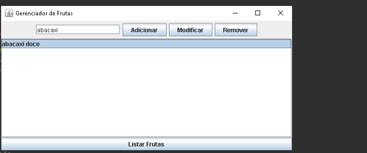

# Lista de Exercícios AC2 - GERENCIAMENTO FRUTAS (GRAPHICAL USER INTERFACE)

## 🚀 Começando

* CRIE UM PROJETO JAVA PARA MESCLAR OS CONHECIMENTOS SOBRE O USO DE ARRAY E DE INTERFACES;

* PARA ISSO CONSTRUA UM CÓDIGO QUE TENHA UM INTERFACE E QUE REALIZE AS OPERAÇÕES ENCONTRADAS NO PROJETO DE GERENCIAMENTO DE FRUTAS;

## 🛠️ Construído com

* IDE Eclipse

## 📌 Versão

* Versão 1.0

## ✒️ Autores

* Nicolas Beloto Armenio - GERENCIAMENTO FRUTAS (GRAPHICAL USER INTERFACE)
